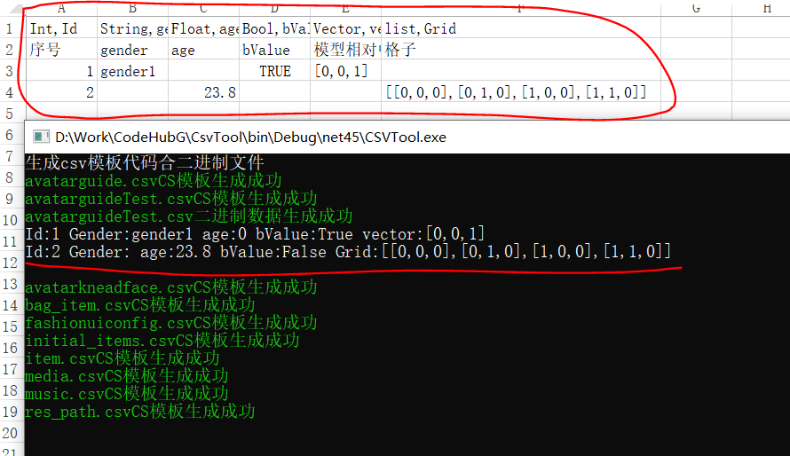

# ExcelTool(Unity打表工具)

通用CSV/Excel打表工具

#### 前言

目前项目中用的csv转json工具，会带来严重的gc性能问题，例如启动加载慢，影响帧率等问题，转成的json数据，我们需要手动写对应的解析模板代码，所以针对以上问题，本通用打表工具应运而生，用二进制数据替代json数据会比较好的解决性能问题，而且能够自动生成对应的模板代码，节省了写重复代码的时间，而且二进制数据比json读取速度更快，文件大小更小。

#### 说明

因为csv有默认的逗号，这跟表中内容配置逗号会有冲突，不利于解析，所有产生了加强版的ExcelTool，读取路径下的csv和excel表格，如果是csv的这先转换成xlsx的excel，然后统一对excel进行数据读取解析操作，生成完之后再把csv生成的excel删掉，确保目录保持原样，所以ExcelTool是CsvTool的升级版

#### 功能

* 支持csv和Excel的打表
* 生成对应的数据模板代码
* 支持生成模板代码字段注释
* 生成二进制文件
* 自动将文件拷贝到对应的工程目录
* 二进制数据读取
* 字段不配置会使用默认数值

#### 目前支持的字段

* 常规的字段，例如int，float，string，bool，long,list,intlist,longlist,floatlist,boollist,List<T> 大小写不限
* 支持自定义字段 vector，例如[1,2,3]
* 支持自定义字段 list,其实是vector数组，例如[[1,2,3],[2,3,4],[4,5,6]]

#### 效果


相比较json，二进制文件大小只有其1/4

##### 自动生成的模板代码

```
/*
 * auto generated by tools(注意:千万不要手动修改本文件)
 * avatarguideTest
 */
using System;
using System.IO;
using System.Collections.Generic;
using System.Text;
using System.Linq;

[Serializable]
public class avatarguideTest : IBinarySerializable
{
	public int Id { get; set; }
	public string gender { get; set; }
	public float age { get; set; }
	public bool bValue { get; set; }
	public List<float> vector { get; set; }
	public List<List<float>> Grid { get; set; }

	public void DeSerialize(BinaryReader reader)
	{
		Id = reader.ReadInt32();
		gender = reader.ReadString();
		age = reader.ReadSingle();
		bValue = reader.ReadBoolean();
		var vectorCount = reader.ReadInt32();
		if (vectorCount > 0)
		{
			vector = new List<float>();
			for (int i = 0; i < vectorCount; i++)
			{
				vector.Add(reader.ReadSingle());
			}
		}
		else
		{
			vector = null;
		}
		var GridCount = reader.ReadInt32();
		if (GridCount > 0)
		{
			Grid = new List<List<float>>();
			for (int i = 0; i < GridCount; i++)
			{
				var tempList = new List<float>();
				var tempListCount = reader.ReadInt32();
				for (int j = 0; j < tempListCount; j++)
				{
					tempList.Add(reader.ReadSingle());
				}
				Grid.Add(tempList);
			}
		}
		else
		{
			Grid = null;
		}
	}

	public void Serialize(BinaryWriter writer)
	{
		writer.Write(Id);
		writer.Write(gender);
		writer.Write(age);
		writer.Write(bValue);
		if (vector == null || vector.Count == 0)
		{
			writer.Write(0);
		}
		else
		{
			writer.Write(vector.Count);
			for (int i = 0; i < vector.Count; i++)
			{
				writer.Write(vector[i]);
			}
		}
		if (Grid == null || Grid.Count == 0)
		{
			writer.Write(0);
		}
		else
		{
			writer.Write(Grid.Count);
			for (int i = 0; i < Grid.Count; i++)
			{
				writer.Write(Grid[i].Count);
				for (int j = 0; j < Grid[i].Count; j++)
				{
					writer.Write(Grid[i][j]);
				}
			}
		}
	}
	public override string ToString()
    {
        var str = $"Id:{Id} Gender:{gender} age:{age} bValue:{bValue} ";
        if (vector != null)
        {
            str += $"vector:[{vector[0]},{vector[1]},{vector[2]}] ";
        }
        if (Grid != null)
        {
            str += "Grid:[";
            for (int i = 0; i < Grid.Count; i++)
            {
                str += $"[{Grid[i][0]},{Grid[i][1]},{Grid[i][2]}]";
                if (i < Grid.Count - 1)
                    str += ",";
            }
            str += "]";
        }
        return str;
    }
}

[Serializable]
public partial class avatarguideTestConfig : IBinarySerializable
{
	public List<avatarguideTest> avatarguideTestInfos = new List<avatarguideTest>();
	public void DeSerialize(BinaryReader reader)
	{
		int count = reader.ReadInt32();
		for (int i = 0;i < count; i++)
		{
			avatarguideTest tempData = new avatarguideTest();
			tempData.DeSerialize(reader);
			avatarguideTestInfos.Add(tempData);
		}
	}

	public void Serialize(BinaryWriter writer)
	{
		writer.Write(avatarguideTestInfos.Count);
		for (int i = 0; i < avatarguideTestInfos.Count; i++)
		{
			avatarguideTestInfos[i].Serialize(writer);
		}
	}

	public IEnumerable<avatarguideTest> QueryById(int id)
	{
		var datas = from d in avatarguideTestInfos
					where d.Id == id
					select d;
		return datas;
	}

	public override string ToString()
        {
	        StringBuilder sb = new StringBuilder();
	        for (int i = 0; i < avatarguideTestInfos.Count; i++)
	        {
	            sb.Append($"{avatarguideTestInfos[i].ToString()}\n");
	        }
	        return sb.ToString();
        }
}
```

#### 使用案例

##### 解析二进制文件

```
IBinarySerializable newavList = new avatarguideTestList();
var readOK = FileManager.ReadBinaryDataFromFile(Path.Combine(path, "avatarguideTest.dat"), ref newavList);
if (readOK)
{
    ConsoleHelper.WriteInfoLine(newavList.ToString());
}
else
{
    ConsoleHelper.WriteErrorLine("读取失败");
}
```



##### Unity解析二进制

将二进制文件(后缀必须是.bytes)放在Resources目录，然后通过Resources.Load接口加载

```
var bytes = Resources.Load<TextAsset>("avatarguideTest");
if (bytes == null)
{
  return;
}
IBinarySerializable newavList = new avatarguideTestConfig();
var readOK = FileManager.ReadBinaryDataFromBytes(bytes.bytes, ref newavList);
if (readOK)
{
   Debug.Log(newavList.ToString());

   //根据Id查询数据
   //var avatarguideTest = (avatarguideTestConfig)newavList;
   //var obj = avatarguideTest.QueryById(2);
   //if (obj != null && obj.Count() > 0)
   //    Debug.Log(obj.FirstOrDefault().ToString());
}
else
{
   Debug.LogError("数据读取错误");
}
```

#### 泛型读表

```
T ReadTable<T>(string tableName) where T : IBinarySerializable, new()
{
var bytes = LoadTextAsset(tableName);
if (bytes != null)
{
    IBinarySerializable data = new T();
    var readOK = FileManager.ReadBinaryDataFromBytes(bytes.bytes, ref data);
    if (readOK)
    {
	return (T)data;
    }
    else
    {
	Debug.LogError($"{tableName}解析出错  类型{typeof(T)}");
    }
}
return default(T);
}
```

##### 查询数据

```
var avatarguideTest = (avatarguideTestConfig)newavList;
var obj = avatarguideTest.QueryById(2);
if (obj != null && obj.Count() > 0)
    ConsoleHelper.WriteInfoLine(obj.FirstOrDefault().ToString());
```

#### 自动化拷贝批处理

```
@echo off

echo "开始拷贝jsons"
for %%i in (*.dat) do (
    echo begin copy... %%i
    copy /y %%~nxi ..\..\hola_unity\Assets\Resources\Config\%%~nxi
    echo copy complate ... %%i
)
echo "拷贝完成"

pause
```

#### 扩展类方法

上面的config类采用的是partical class 就是为了方便扩展自定义的方法，如果想要添加自定义方法也定义一个partical class文件作为扩展即可

#### 待扩展的功能

目前还不是最理想的状态，还有很多可以扩展完善的功能，如下：

* 支持生成各种类型的文件，例如json、xml、proto、lua等
* 支持生成各种语法的模板代码
* 支持Excel数据配置规范性检测，例如手误配置不符合规范导致加载异常，例如大小写逗号(肉眼容易忽略)，或者空格等等
* 支持Excel字段客户端服务器可选项
* 支持更多自定义数据类型扩展
* 支持枚举类型

#### 代码

https://github.com/dingxiaowei/ExcelTool  喜欢麻烦点个star吧

#### Unity客户端使用范例

采用的美术效果机型适配商业化解决方案Demo
https://github.com/dingxiaowei/DeviceGrading
优雅的表格使用范本

